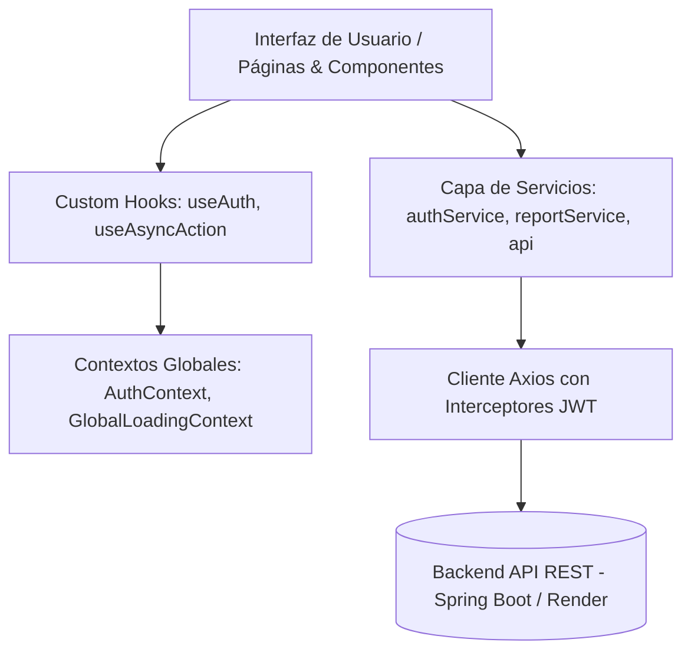

# 🤖 RoboTech — Plataforma de Gestión de Torneos de Robótica Competitiva

> **Frontend oficial de RoboTech**: Sistema web integral para la administración, fiscalización y seguimiento en tiempo real de competencias y torneos de robótica, clubes, competidores y combates.

---

## 📋 Tabla de Contenidos
1. [Descripción General](#-descripción-general)
2. [Arquitectura del Sistema](#-arquitectura-del-sistema)
3. [Modelo de Roles y Seguridad (RBAC)](#-modelo-de-roles-y-seguridad-rbac)
4. [Módulos y Funcionalidades Principales](#-módulos-y-funcionalidades-principales)
   - [Autenticación y Cuentas](#1-autenticación-y-recuperación-de-cuentas)
   - [Gestión y Seguimiento de Torneos](#2-gestión-y-seguimiento-de-torneos)
   - [Gestión de Clubes y Miembros](#3-gestión-de-clubes-y-miembros)
   - [Transferencias y Protocolo de Deshabilitación](#4-transferencias-y-protocolo-de-deshabilitación)
   - [Registro y Homologación de Robots](#5-registro-y-homologación-de-robots)
   - [Sistema de Reportes y Estadísticas (PDF)](#6-sistema-de-reportes-y-estadísticas-pdf)
5. [Estructura del Proyecto](#-estructura-del-proyecto)
6. [Rutas de la Aplicación](#-rutas-de-la-aplicación)
7. [Tecnologías Utilizadas](#-tecnologías-utilizadas)
8. [Instalación y Configuración](#-instalación-y-configuración)

---

## 🌐 Descripción General

**RoboTech** es una solución web orientada a comunidades y federaciones de robótica competitiva (como batallas de robots, seguidores de línea, mini-sumo, etc.). Permite digitalizar todo el ciclo de vida de un torneo de robótica:

- **Organización y Logística**: Definición de sedes físicas, categorías con límites de peso y reglas técnicas, así como programación de fechas y asignación de jueces oficiales.
- **Homologación Técnica**: Control y validación rigurosa de los robots inscritos por parte de los responsables de cada club.
- **Dinámica de Torneos**: Emparejamientos automáticos mediante modalidades como *Eliminatoria Directa* o *Todos contra Todos*, brackets visuales interactivos y actualización de puntajes en tiempo real.
- **Acceso Público**: Visualización comunitaria de torneos en curso, rankings actualizados y brackets con refresco periódico.
- **Métricas y Descargas**: Generación y exportación de reportes ejecutivos y actas oficiales en formato PDF.

---

## 🏛️ Arquitectura del Sistema

La aplicación está desarrollada bajo un esquema SPA (*Single Page Application*) con **React 19** y **Vite**, desacoplada del backend mediante una **API RESTful**.

### Flujo de Arquitectura y Capas



### Principios de Diseño
- **Seguridad y Token JWT**: El token de autenticación se inyecta dinámicamente en las cabeceras HTTP (`Authorization: Bearer <token>`). Las respuestas `401 Unauthorized` redirigen automáticamente al login y purgan las credenciales locales.
- **Prevención de Doble Envío y Estado Global de Carga**: Se implementa el hook `useAsyncAction` combinado con `GlobalLoadingContext` para inhabilitar botones y llamadas concurrentes mientras se ejecutan operaciones asíncronas críticas (creación de torneos, asignación de puntos, aprobación de transferencias).
- **Separación de Responsabilidades**: Lógica de presentación dividida por dominios (`admin`, `dashboard`, `torneos`, `common`) y desacoplada de las llamadas HTTP mediante servicios (`src/services/`).

---

## 👥 Modelo de Roles y Seguridad (RBAC)

La plataforma cuenta con un sistema de autorización basado en roles:

| Rol | Identificador | Responsabilidades Principales |
| :--- | :--- | :--- |
| **Administrador** | `ROLE_ADMIN` | Control total del sistema: gestión de sedes, categorías de peso, creación de torneos, códigos de acceso, supervisión de usuarios, reseteo administrativo de credenciales y deshabilitación de clubes. |
| **Dueño de Club** | `ROLE_CLUB_OWNER` | Gestión del perfil del club, administración de miembros, emisión de códigos de invitación, aprobación/rechazo técnico de robots y procesamiento de transferencias (entradas y salidas). |
| **Competidor** | `ROLE_COMPETITOR` | Registro y mantenimiento de robots (respetando los topes de peso), inscripción de robots a torneos activos y solicitud de transferencias a otros clubes. |
| **Juez / Árbitro** | `ROLE_JUDGE` | Operación en pista de los torneos: selección de modalidad (Eliminatoria o Round Robin), generación de enfrentamientos, registro y confirmación de puntajes por combate y avance de fases en el bracket. |
| **Usuario General** | `ROLE_USER` | Usuario registrado sin afiliación activa a un club (o degradado tras cierre de su club anterior). Puede explorar clubes disponibles y solicitar su ingreso formal. |

---

## ⚙️ Módulos y Funcionalidades Principales

### 1. Autenticación y Recuperación de Cuentas
- **Registro Seguro**: Soporte para registro de usuarios con selección de club o uso de códigos de registro especiales emitidos por administradores o directores de clubes.
- **Inicio de Sesión**: Generación y almacenamiento local de token JWT con persistencia de roles.
- **Recuperación Autónoma**: Solicitud de restablecimiento de contraseña vía correo electrónico con enlace tokenizado (`/reset-password`).
- **Reseteo Administrativo**: Panel especial para que administradores puedan buscar usuarios por DNI y generar credenciales temporales en caso de pérdida de acceso.

### 2. Gestión y Seguimiento de Torneos
- **Creación y Configuración**: Definición de nombre, descripción, sede, categoría y juez responsable.
- **Activación Programada**: Soporte para activación manual o temporizada con cuenta regresiva en vivo (`CountdownTimer`).
- **Modalidades de Competición**:
  - *Eliminatoria Directa*: Generación de rondas clasificatorias, semifinales y final con avance automático de robots ganadores.
  - *Todos contra Todos (Round Robin)*: Calendario completo de enfrentamientos entre todos los robots inscritos.
- **Brackets Públicos e Interactivos**: Visualización en árbol de emparejamientos, puntajes por participante, estado de combates y auto-actualización periódica en segundo plano.
- **Rankings y Posiciones**: Modal dinámico con la tabla de clasificación por torneo y puntos acumulados.
- **Historial**: Consulta de torneos finalizados y sus resultados históricos.

### 3. Gestión de Clubes y Miembros
- **Perfil de Club**: Configuración de nombre, descripción, ciudad y país sede.
- **Directorio de Miembros**: Visualización de los competidores afiliados al club.
- **Códigos de Registro**: Generación de códigos únicos con fecha de caducidad para permitir la afiliación directa de nuevos miembros.

### 4. Transferencias y Protocolo de Deshabilitación
- **Flujo de Transferencia en 2 Pasos**:
  1. El competidor solicita el pase a un club destino.
  2. El club de origen debe aprobar la liberación (`procesarSalida`).
  3. El club receptor aprueba la admisión (`procesarIngreso`), actualizando la afiliación del competidor.
- **Protocolo de Cierre / Deshabilitación de Clubes**:
  - El administrador puede marcar un club como deshabilitado con un plazo límite de gracia (ej. 7 días).
  - Permite la emisión de transferencias masivas para reubicar a los miembros en otro club.
  - Vencido el plazo, los miembros remanentes son degradados a `ROLE_USER` para que puedan solicitar libremente un nuevo club.

### 5. Registro y Homologación de Robots
- **Ficha Técnica del Robot**: Nombre, descripción, especificaciones de componentes y fotografía / render.
- **Control de Pesaje por Categoría**: Validación obligatoria en cliente y servidor donde el peso en gramos no puede exceder el `pesoMaximo` de la categoría seleccionada.
- **Homologación Técnica**: Todo robot creado o editado pasa a estado `PENDIENTE`. Solo tras la inspección y aprobación formal por parte del `CLUB_OWNER` adquiere el estado `APROBADO`, habilitándolo para competir. En caso de rechazo, se registra un motivo detallado.

### 6. Sistema de Reportes y Estadísticas (PDF)
Descarga en tiempo real de documentos y actas oficiales generadas por el backend mediante streaming de datos binarios (`Blob`):
- **Reporte Completo de Torneo**: Datos generales, nómina de participantes, ranking y detalle de cada combate.
- **Reporte de Ranking**: Resumen de podio y puntuaciones finales.
- **Estadísticas de Club**: Listado de robots, miembros activos, efectividad y victorias registradas.
- **Reportes Globales para Administradores**: Consolidado general de todos los clubes y todos los torneos del ecosistema.

---

## 📁 Estructura del Proyecto

```plaintext
robotech-frontend/
├── public/                     # Archivos estáticos
├── src/
│   ├── assets/                 # Recursos gráficos, íconos y SVGs
│   ├── components/
│   │   ├── admin/              # Componentes de uso exclusivo del Administrador
│   │   │   ├── ClubDeshabilitacionPanel.jsx  # Gestión del protocolo de cierre de clubes
│   │   │   ├── CountdownTimer.jsx            # Contador para torneos programados
│   │   │   ├── EmailResetPanel.jsx           # Búsqueda por DNI y reseteo de emails
│   │   │   └── SedePanel.jsx                 # Alta y administración de sedes físicas
│   │   ├── common/             # Componentes reutilizables transversales
│   │   │   ├── Navbar.jsx                    # Barra de navegación adaptable según rol
│   │   │   ├── PrivateRoute.jsx              # Guardián de rutas protegidas
│   │   │   └── ReportButton.jsx              # Botón estilizado para descargas PDF
│   │   ├── dashboard/          # Paneles especializados por cada rol de usuario
│   │   │   ├── AdminPanel.jsx                # Panel de control de ROLE_ADMIN
│   │   │   ├── ClubOwnerPanel.jsx            # Panel de control de ROLE_CLUB_OWNER
│   │   │   ├── CompetitorPanel.jsx           # Panel de control de ROLE_COMPETITOR
│   │   │   ├── JudgePanel.jsx                # Panel de arbitraje para ROLE_JUDGE
│   │   │   ├── UserPanel.jsx                 # Panel para usuarios base y sin club
│   │   │   └── *ReportsSection.jsx           # Secciones de reportes PDF por rol
│   │   └── torneos/            # Módulos públicos de torneos y competencias
│   │       ├── BracketPublico.jsx            # Árbol visual de eliminatorias en vivo
│   │       ├── HistorialTorneos.jsx          # Archivo de torneos finalizados
│   │       └── RankingTorneo.jsx             # Modal con tabla de clasificación
│   ├── context/
│   │   ├── AuthContext.jsx                   # Estado global de sesión y permisos
│   │   └── GlobalLoadingContext.jsx          # Control de carga global y bloqueo de UI
│   ├── hooks/
│   │   ├── useAuth.js                        # Hook para consumir AuthContext
│   │   └── useAsyncAction.js                 # Manejo unificado de loaders y errores asíncronos
│   ├── pages/
│   │   ├── Dashboard.jsx                     # Enrutador inteligente según el rol del usuario
│   │   ├── Home.jsx                          # Landing page principal
│   │   ├── JudgeDashboard.jsx                # Acceso rápido para jueces
│   │   ├── Login.jsx                         # Pantalla de inicio de sesión
│   │   ├── RecuperarPassword.jsx             # Solicitud y restablecimiento con token
│   │   ├── Register.jsx                      # Formulario de registro de nuevos usuarios
│   │   └── TorneosPublicos.jsx               # Catálogo público de torneos activos
│   ├── services/
│   │   ├── api.js                            # Instancia de Axios con interceptores JWT
│   │   ├── authService.js                    # Servicios de Auth, Torneos, Robots, Clubs y Users
│   │   └── reportService.js                  # Manejador de descarga de archivos PDF binarios
│   ├── utils/
│   │   └── constants.js                      # URL base del API y enumeraciones de Roles/Estados
│   ├── App.css                               # Estilos globales y tema cyberpunk/neón
│   ├── App.jsx                               # Configuración de enrutamiento y proveedores
│   ├── index.css                             # Resets y variables CSS
│   └── main.jsx                              # Punto de entrada de React
├── package.json                              # Dependencias y scripts de ejecución
├── vite.config.js                            # Configuración del bundler Vite
└── README.md                                 # Documentación del proyecto
```

---

## 🛣️ Rutas de la Aplicación

### Rutas Públicas
- `/`: Portada institucional de RoboTech.
- `/login`: Formulario de acceso al sistema.
- `/register`: Registro de nuevos competidores y usuarios.
- `/reset-password`: Recuperación de contraseña olvidada.
- `/torneos`: Lista pública de torneos activos y acceso a rankings.
- `/brackets` o `/brackets/:torneoId`: Visualización interactiva del bracket en tiempo real.
- `/historial`: Archivo histórico de torneos culminados.

### Rutas Protegidas (`<PrivateRoute>`)
- `/dashboard`: Redirige automáticamente al panel correspondiente según el rol del usuario autenticado:
  - **Admin** ➔ `AdminPanel`
  - **Dueño de Club** ➔ `ClubOwnerPanel`
  - **Competidor** ➔ `CompetitorPanel`
  - **Juez** ➔ `JudgePanel`
  - **Usuario sin club** ➔ `UserPanel`

---

## 🛠️ Tecnologías Utilizadas

- **Librería UI**: [React 19](https://react.dev/)
- **Empaquetador y Servidor Dev**: [Vite](https://vitejs.dev/)
- **Enrutamiento**: [React Router DOM v7](https://reactrouter.com/)
- **Cliente HTTP**: [Axios](https://axios-http.com/)
- **Notificaciones**: [React-Toastify](https://fkhadra.github.io/react-toastify/)
- **Linter**: ESLint 9 con soporte para React Hooks
- **Diseño**: CSS modular nativo con paleta oscura, efectos neón y diseño responsivo

---

## 🚀 Instalación y Configuración

### Prerrequisitos
- **Node.js** (versión 18.x o superior recomendada)
- **npm** o **yarn**

### Pasos de Instalación

1. **Clonar el repositorio:**
   ```bash
   git clone https://github.com/JorgeRuiz20/FrontendRobotech.git
   cd FrontendRobotech
   ```

2. **Instalar dependencias:**
   ```bash
   npm install
   ```

3. **Configuración de Variables de Entorno / API:**
   Por defecto, la API REST se encuentra configurada en `src/utils/constants.js`:
   ```javascript
   export const API_URL = 'https://backendrobotech.onrender.com/api';
   ```
   Si deseas utilizar un servidor local (por ejemplo Spring Boot en `http://localhost:8080/api`), actualiza dicha constante o conéctala a una variable de entorno `VITE_API_URL`.

4. **Ejecutar el servidor de desarrollo:**
   ```bash
   npm run dev
   ```
   Abre [http://localhost:5173](http://localhost:5173) en tu navegador.

5. **Generar compilación para producción:**
   ```bash
   npm run build
   ```

6. **Previsualizar la compilación de producción:**
   ```bash
   npm run preview
   ```

---

<p align="center">
  Hecho con ⚡ para la comunidad de robótica competitiva.
</p>
